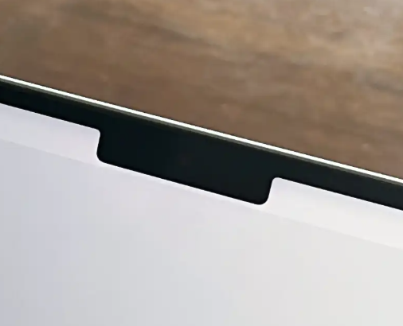
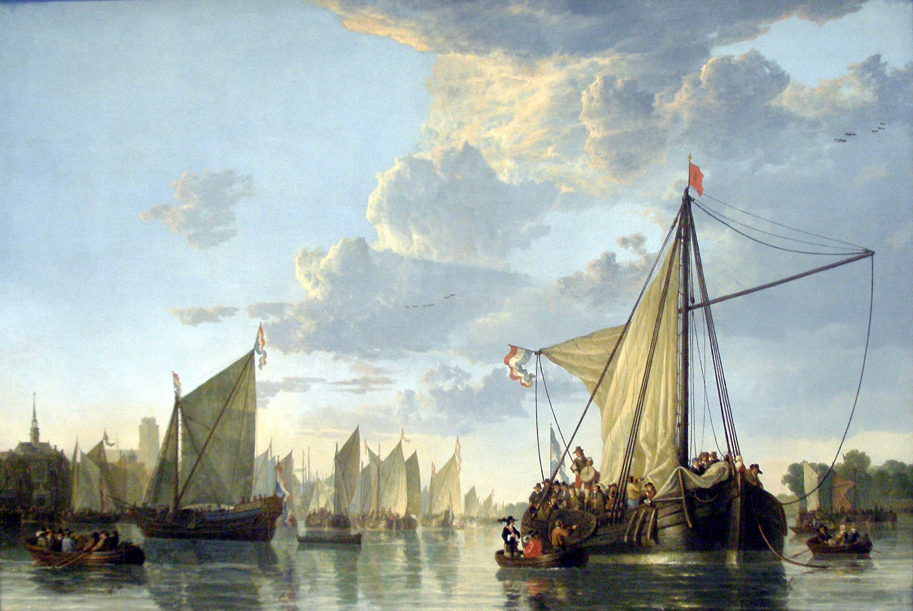
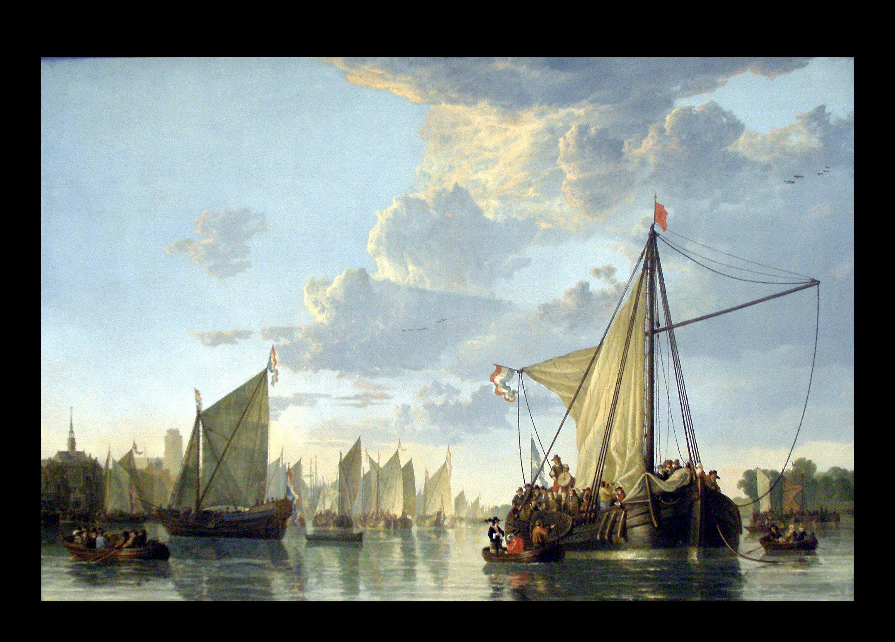

# Add border to image

Literally just a CLI tool that adds a fixed black border to the top of a user-supplied image.

## Why

The latest itterations of Apple's Macbooks have this stupid little notch at the top for the camera.



I don't like looking at that notch, but the only real way to hid it is by setting the desktop background to black. I like setting pretty pictures for my wallpaper, and I like chaging said pictures every once in a while. So I (read Claude.ai) created this CLI tool to:

- Take an image.
- Apply a black border to the top of it (7% of the image width).
- Save the image in the same location without any compression.

This creates a letterbox effect that hides the notch when used as a desktop background.

### Original image



### Image with a top border



## Install

### Prebuilt binary

There's a prebuilt binary over in the [Releases](https://github.com/johnnymatthews/add-border-to-image/releases) section of this repo. Just grab that and throw it somewhere useful:

```shell
sudo curl -L https://github.com/johnnymatthews/add-border-to-image/releases/download/v1.1.0/image-border -o /usr/local/bin/image-border
sudo chmod +x /usr/local/bin/image-border
```

### Build from source

1. Install Rust.
1. Download this repo:

  ```shell
  git clone https://github.com/johnnymatthews/add-border-to-image.git
  cd add-border-to-image
  ```

1. Build it:

  ```shell
  cargo build --release
  ```

1. You've now got a nice little executable in `./target/release/` called `image-border`.
1. If you want, you can move it somewhere nice so that you can run this crap from anywhere on your machine:

  ```shell
  sudo mv ./target/release/image-border /usr/local/bin
  ```

1. Done.

## Usage

```shell
image-border path/to/your/image.jpg
```

The tool will create a new image with `-with-border` added to the filename in the same directory as the original image.

**Supported formats:** JPG, JPEG, PNG

## Who

I can't imagine anyone else other than me is gonna use this tool. But it's here if you want it.
